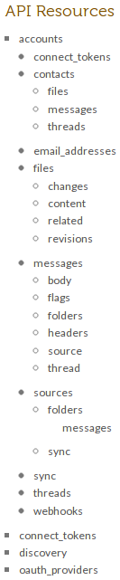
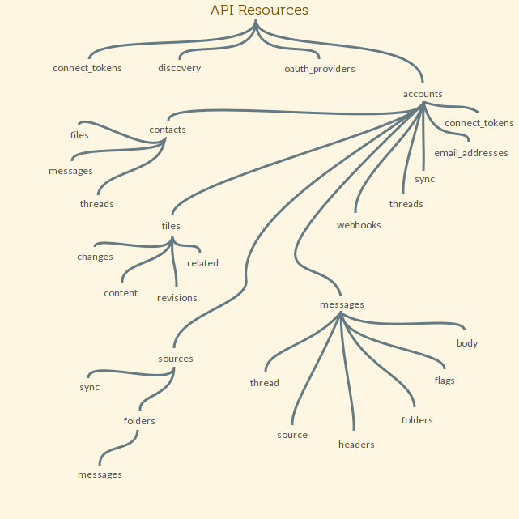

!SLIDE subsection
# So, you're gonna make an API client gem.
## Where do you start?

!SLIDE
###### How is the API structured?

!SLIDE

!SLIDE

!SLIDE
###### Translation, Not Transliteration

!SLIDE
example of class or structure difference here

!SLIDE
    {
      "isAwesome": true,
      "name": "Austin.rb",
      "created": 1303387200
    }

###### ↓

    @@@ ruby
    meet_up.awesome? #=> true
    meet_up.name #=> "Austin.rb"
    meet_up.created_at
      #=> 2011-04-21 07:00:00 -0500

!SLIDE bullets incremental
###### Steal Metaphors Wholesale

* `Enumerable`
* `ActiveRecord::Base`
